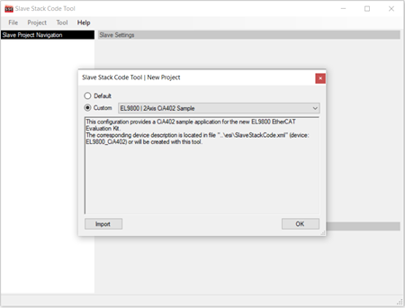
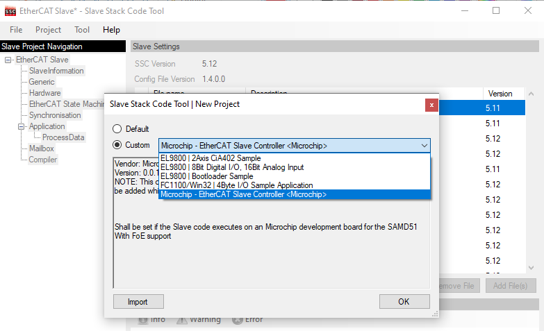
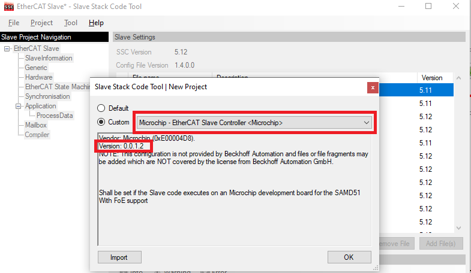
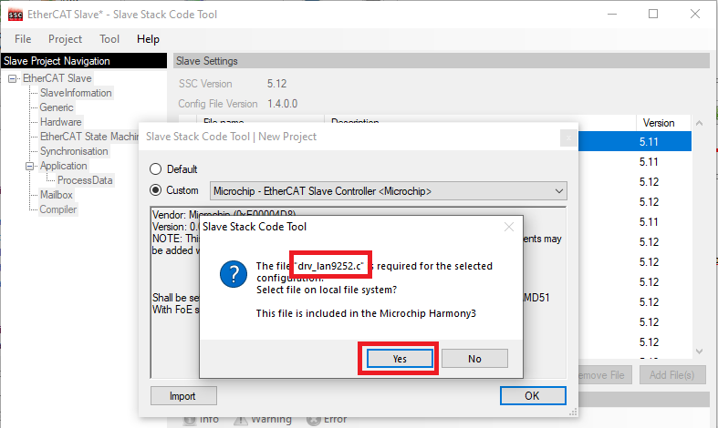
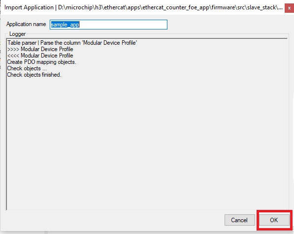
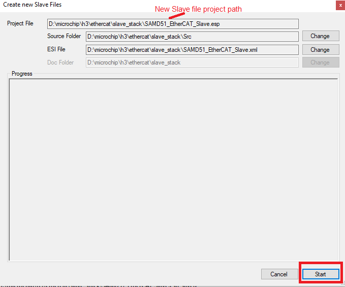

# **Slave Stack Code Generation**

1. Download the Slave Stack Code (SSC) Tool from EtherCAT.org website. An EtherCAT membership is necessary to download the code. The following link can be used to download the tool.

    [EtherCAT Slave Stack Code (SSC) v5.12](https://www.ethercat.org/en/downloads/downloads_01DCC32A10294F2EA866F7E46FB0285F.htm)

2.	Install the SSC Tool on the control/management PC
3.	Open the SSC Tool and navigate to File => New to create a New Project
4.	Select Custom and then click Import

    

5.	Import “Microchip-SAMD51-LAN925x-SSC_Config.xml” configuration file from **< Harmony Directory >/ethercat/apps/ethercat_counter_foe_app/firmware/src/slave_stack**. After importing this configuration file, the **Microchip - EtherCAT Slave Controller < Microchip >**  will appear in the custom field.

    

    Select this and click OK. Click Yes to the next two prompts

    

6.	The driver **drv_lan9252.c** is required for this configuration and to select file , Click **yes**. In the SSC tool navigate to the **< Harmony Directory >/ethercat/apps/ethercat_counter_foe_app/firmware/src/config/sam_d51_lan9252_evb/driver/lan9252** directory to point to the **drv_lan9252.c** file and click Open. This will load the code.

    

7.	Click on **Tools=>Application=>Import**  and select **sample_app.xlsx** application file from the path **< Harmony Directory >/ethercat/apps/ethercat_counter_foe_app/firmware/src/slave_stack** . Click OK to the next prompt

    

8.	Click on **Tools=>Create New Slave Files**. When prompted to save the project, save the project in the directory provided with name **SAMD51_EtherCAT_Slave.esp**.
    *  Click the Project drop-down menu in the tool bar and select Create New Slave Files. The pop-up windows open the newly slave file project ( SAMD51_EtherCAT_Slave.esp ),

        

    * Click the Start button to create a new project file, **Src** folder, and **ESI** file (Slave Information file) in the desired directory path.

    * A pop-up window will indicate that the files have been successfully created. Click OK to continue.

    * Along with generated new slave files, ESI file (.xml file) also will be generated. This ESI file will have information about new Vendor ID and object configuration. This ESI file will be used by the **TwinCAT Manager** and is used to be programmed using "EEPROM Programming".

    **NOTE** - **EEPROM Programming** is described in **Running the demo application** section

9. Browse to the directory where the new files were created, as shown in the example:
    * Src (Folder): This folder contains the Beckhoff Slave Stack code.
    * SAMD51_EtherCAT_Slave (ESP): This is the SSC Tool project file.
    * SAMD51_EtherCAT_Slave (XML): This is the EtherCAT® slave information file that must be used as an input to the EtherCAT master tool to configure EtherCAT® slave controllers.

10. The generated sample_app.c , does not have the counter, trigger configuration details and FoE read/write operations. So, the present **sample_app.c, sample_app.h, sample_appObject.h** can be updated from the location **< Harmony Directory >/ethercat/apps/ethercat_counter_foe_app/firmware/src/slave_stack**.
