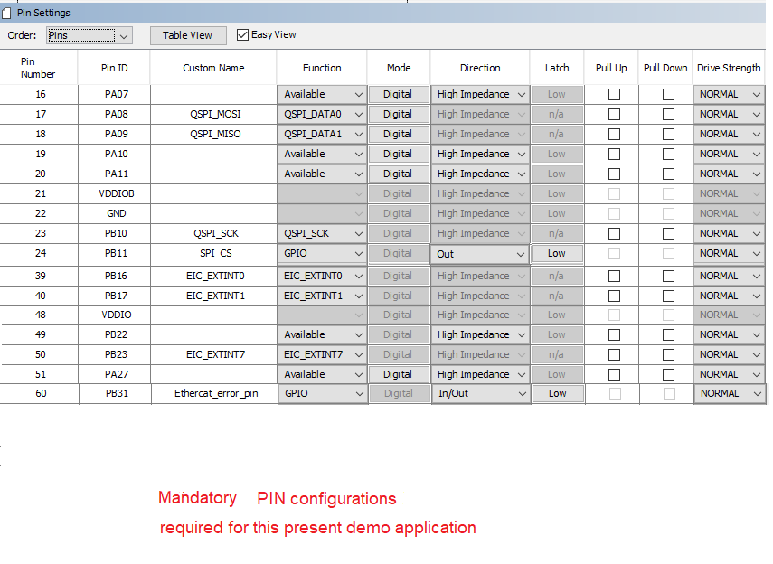
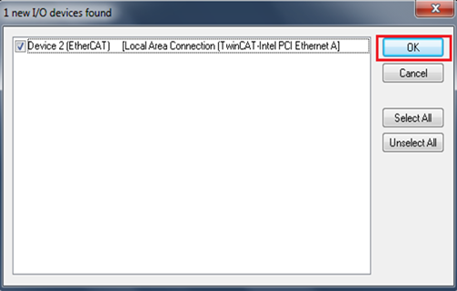
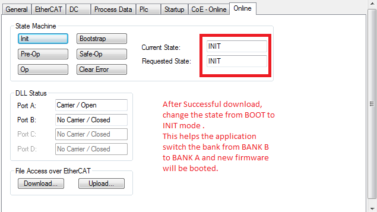

# EtherCAT Counter FoE Application for EVM_LAN9252_SAMD51

This EtherCAT example application demonstrates Firmware Update over EtherCAT capability. The firmware update is performed via FoE (File over EtherCAT). It is triggered byt the EtherCAT Master ( TwinCAT Master ) which then download the firmware onto the EtherCAT slave (LAN9252) on the  EVB_LAN9252_SAMD51 board.

**Note :** The EtherCAT Library can be configured to also execute on other EthertCAT development boards availabe from Microchip. Additional instruction at available in the [Create your first EtherCAT Application](https://github.com/Microchip-MPLAB-Harmony/ethercat/wiki/create-your-first-ethercat-application) section. 

This demonstration help document contains the following sections: 

1. MPLAB® Harmony Software Setup
2. Hardware Setup
3. MPLAB Harmony configuration
4. Build The EtherCAT Application
5. Running The Application
    1. Slave Stack Code (SSC) Generation
    2. TwinCAT Manager and Microchip EtherCAT Slave communication
        1. TwinCAT EtherCAT interface detect and EEPROM Programming
        2. Trigger and Counter Demonstration
        3. File over EtherCAT communication

## **MPLAB® Harmony Software Setup**
The following MPLAB® software components are a prerequisite for the subsequent steps in this demonstration. Please follow the download and installation instructions available at below links.
  * [MPLAB® X Integrated Development Environment](https://www.microchip.com/mplab/mplab-x-ide)
  * [MPLAB® XC32/32++ C Compiler](https://www.microchip.com/mplab/compilers)
  * [MPLAB® Harmony Configurator](https://github.com/Microchip-MPLAB-Harmony/)
  * On the management PC, download and install the TwinCAT 3 Engineering Full Setup at https://www.beckhoff.com/english.asp?download/tc3-download-xae.htm. Select the latest TwinCAT 3.1 Version and click on the link. Note the dialog box that shows the TwinCAT tool to be installed **TC31-Full-Setup.3.1.XXXX.XX** and click on "Start Download". Follow instructions to download.

## **Hardware Setup**
The following tools will be used to program and debug the application on the target hardware.
 * [MPLAB® ICD4]( https://www.microchip.com/DevelopmentTools/ProductDetails/DV164045) + ICD4/PICKIT 3 Target Adapter Board using JTAG interface.

The following development board will be used to develop and execute the EtherCAT application.

  * [LAN9252 - EtherCAT Slave Controller evaluation kit with SAMD51 Microcontroller](https://www.microchip.com/DevelopmentTools/ProductDetails/PartNO/EV44C93A#additional-summary)

    The instructions in this guide are also  applicable to other development boards with LAN9252 EtherCAT slave device. Hardware settings are board dependent and may vary between boards.

  * Connect a micro USB cable to port J8 to power the board..
  * For programming, connect a ICD4 JTAG cable to port J10 of the EVB_LAN9252_SAMD51 board.
  * Connect RJ45 connector J1 to the TwinCAT Manager.

  * Block diagram of the EVB_LAN9252_SAMD51 board -

    

## **MPLAB® Harmony configuration**
There are two options available for downloading/installing the MPLAB® Harmony Software Repositories from github & gitee.

The required repositories can be cloned from the github (or gitee) by using a local git client (such git bash). The MPLAB® Harmony Repositories are available at the following links:

 <https://github.com/Microchip-MPLAB-Harmony/>

 <https://gitee.com/Microchip-MPLAB-Harmony/>

The **csp, dev_packs, mhc and ethercat** repositories should be cloned. The required repositories can also be cloned (downloaded) or previously downloaded repositories can also be updated by using the MPLAB® Harmony 3 Content Manager. The following sections provide details on using the MPLAB® Harmony 3 Content Manager to download the repositories.

1. Refer to the EtherCAT **MPLAB® Harmony Software Setup** https://github.com/Microchip-MPLAB-Harmony/ethercat/wiki/create-your-first-ethercat-application for details about creating an EtherCAT project.

2. The following Project Graph diagram shows the MPLAB Harmony Library components that are required by the FoE EtherCAT application on the EVB_LAN9252_SAMD51 board.

    

3. Click on the EtherCAT Stack in the Project Graph window. In the Configuration window,   
    * The **Slave Stack source directory path** should point to the folder that contains the files generated by the SSC tool.
    * The **Enable FoE** checkbox enables **File over EtherCAT** feature.

    

4. Click on **LAN9252** component from the project graph.
    * **EtherCAT Interrupt Priority Level** :- This defines a interrupt priority range. All application interrupts whose priority is more than or equal to this level will be disabled during an EtherCAT interrupt service routine execution.
    * Following table maps EtherCAT interrupt name with respective peripheral channel selection. **EIC interrupt handler and the SPI chip select Configuration for EVB_LAN9252_SAMD51**

        | Interrupt  Name   |   EIC Channel  |    
        |-------------------|:--------------:|
        | SYNC0  Interrupt  |  EIC_EXTINT0   |
        | SYNC1  Interrupt  |  EIC_EXTINT1   |
        | IRQ    Interrupt  |  EIC_EXTINT7   |

        | Other Usage       |   Port Pin     |
        |:-----------------:|:--------------:|
        | SPI Chip Select   |  PORT RB11     |
        | Error Select Pin  |  PORT RB31     |

    **NOTE** - EIC/GPIO/PIO pins for External event registration and event handler processing can be selected based on the micrcontroller and LAN9252 interrupt support.

    

5. **EIC**, **QSPI** and **TC0** are configured as per the application requirement.

6. The below PINs are configured for the application

    * **QSPI PIN Configuration for EVB_LAN9252_SAMD51**

        | QSPI Custom Name  |   Function       | PORT PIN ID  |
        |:-----------------:|:----------------:|:------------:|
        | QSPI_MOSI         |  QSPI_DATA0      |    PA08      |
        | QSPI_MISO         |  QSPI_DATA1      |    PA09      |
        | QSPI_SCK          |  QSPI_SCK        |    PB10      |
        | SPI_CS            |   GPIO           |    PB11      |

    * **PIN Configuration for EtherCAT External Interrupt Pins for EVB_LAN9252_SAMD51**

        | EIC Custom Name |   EIC Channel  |    Port Pin    |
        |:---------------:|:--------------:|:--------------:|
        | EIC_EXTINT0     |  EIC_EXTINT0   |   PORT  PB16   |
        | EIC_EXTINT1     |  EIC_EXTINT1   |   PORT  PB17   |
        | EIC_EXTINT7     |  EIC_EXTINT7   |   PORT  PB23   |

    

7. Open **NVIC configuration** window from MHC→Tools. Set the QSPI Interrupt Priority Level to 2. This interrupt priority level is selected to be less than value of the **EtherCAT Interrupt Priority Level** configuration option in the **LAN9252** component.

    

8. The application will use the default clock options. No changes are required in clock settings.

9.  The FoE application uses a customized linker file. The **ROM_LENGTH** attribute in the linker file is modified to 0x40000 for ATSAMD51J19A. Bank A memory range is configured between 0x00000 to 0x3FFFF. Bank B memory range is configured between 0x40000 to 0x7FFFF.

    The **Dual Bank** feature enables the FoE firmware to be executed from one bank while an updated version of the firmware is programmed into the other bank. The APP_BankSwitch() application function is called to swap the banks and to reset the device when the programming is complete. The APP_RunApplication() function is called to execute the new firmware. 

    To add a customized linker file to the project, uncheck the **Add linker file to project** option. Navigate to **System>Project Configuration>Tool Chain Selections>Add linker file** in the MHC Project graph to add the customized linked script file.

    See the below screen capture:    
    

10. Generate the code by clicking the **Generate Code** button (marked in red).

    

11. The following diagram shows the generated EtherCAT project. This contains the **sample_app.c** file. It does not contain the Slave stack code. The Slave Stack Code should be generated using the SSC tool with the required configuration and the Microchip-SAMD51-EtherCAT-Slave_SSC_Config.xml file. The folder view on the right side in the below figure shows the EtherCAT project with SSC stack files added to the folder.

    

## **Completing The EtherCAT Application**

At this point, the FoE application MPLABX IDE project is ready along with the SSC Tool generated code.  This section describes the steps to be followed to update the FoE application files.  The following table list the MPLAB X projects available for the demonstration. The path for the following project which is part of this project table, is available at **< install-dir >/ethercat/apps/ethercat_counter_foe_app/firmware**.

1. MPLABx project table

    | Project Name  |  Target Device | Target Development board  | Description |
    |:-------------:|:--------------:|:------------------------:|:-----------:|
    |sam_d51_lan9252_evb.X|ATSAMD51J19A|EVB-LAN9252_SAMD51|ETherCAT evaluation board with LAN9252|

2. The project contains the MPLAB® Harmony components that are required for an EtherCAT application. The application files need to be added to the project.

  The application source files for the **ethercat_counter_foe_app** demo which are available in **Harmony_Repo_Path/h3/ethercat/apps/ethercat_counter_foe_app/firmware/src**.

3. The **app.c**, **app.h**, **main.c** files are updated to demonstrate the application.

4. The **apps/ethercat_counter_foe_app/firmware/src/config/sam_d51_lan9252_evb/ethercat_foe.ld** linker file is a modified linker file which is used for FOE application.

5. The sample application files **sample_app.c**, **sample_app.h** and **sample_appObjects.h** which are generated by SSC tool and are updated for the application requirement.

    

    The above SSC tool generated sample application files are updated for Counter and Trigger peripheral interface and also updated for the FoE read/write operations. we can find these files in path **apps/ethercat_counter_foe_app/firmware/src/slave_stack**.

6. Verify the **XC32** Compiler Toolchain version and set the **Connected Hardware Tool** to **ICD4** J10 or **PICkit 3**. Press **Apply** button and then press **OK** button.

7. Build the application by clicking on the **Build Main Project**.

## **Running The Application**

### **Slave Stack Code (SSC) Generation**

[Steps to generate Slave Stack Code  ](../../docs/readme_ssctool.md)

### **TwinCAT Manager and Microchip EtherCAT Slave communication**

#### TwinCAT EtherCAT interface detect and EEPROM Programming

1. Upon successful installation of the TwinCAT Manager, the network adapter will be moved to Installed and ready to use devices section as shown in the following figure.

    

    Copy the   available **SAMD51_EtherCAT_Slave.xml** file from **< harmony-repo >app/ethercat/slave_stack/lan9252/** directory to the **TwinCAT\3.1\Config\Io\EtherCAT** directory.

2. In TwinCAT XAE, create a New Project **(File=>New=>Project)**. In the New Project Window, select the TwinCAT Projects option and then click OK

    

3. Connect port zero (J1 connection) of the EVB_LAN9252_SAMD51 board to the TwinCAT master using a RJ45 Ethernet cable, and then power up the board. The Link/Act LED should be ON at Port zero when the cable is connected. If the Link/Act LED is not ON, then this indicates that there is an issue with the connection or the cable.

4. Expand the IO option in the TwinCAT XAE project window and right click on Devices. Select Scan.

   

5. Click OK  if the TwinCAT network interface is selected  and continue scanning as shown in the below image.

    

6. Click OK to continue scanning  and Click Yes in the Scan for boxes prompt.

    

7. **EEPROM Programming** After a successful scan, click on Device 2 (EtherCAT) in the solution explorer window of the TwinCAT tool  and Click Online in the TwinCAT project window. Once this is done, highlight the Device, and it should read OP.

    

#### Trigger and Counter Demonstration

1. **Input Trigger configuration** - From I/O level on the Solution Explorer (left window), go to **Devices=>Device # (EtherCAT)=>Box 1 (SAMD51 EtherCAT Slave)=>Outputs process data mapping=>Trigger**.

2. In the top center window, select Online tab. Click Write and then enter **1** in Decimal: field and click OK.

    

3. **Output Counter Observation** - From I/O level on the Solution Explorer (left window), go to **Devices=>Device # (EtherCAT)=>Box 1 (SAMD51 EtherCAT Slave)=>Inputs process data mapping=>Counter**.

4.	In the top center window, select Online tab. The counter value should be incrementing.

    

#### File over EtherCAT communication

1. **FoE (File over EtherCAT) Test Update** - Click on Box1, Select "Online" tab.
    Before FoE test **Curent state** and **Requested state** should be in **OP** mode.

    

2. For file download, change the mode from INIT to BOOT mode.

    

3. After clicking **Download** button , select **BIN** file that need to be downloaded and configure the **Password** as per the **EtherCAT component password** configuration.

    

    The sample **BIN** files are present in **< harmony-repo >/ethercat/apps/ethercat_counter_foe_app/firmware/src/FoE_Bin_imagefiles/lan9252_foe_binfiles** which can be used for the FoE verification.

     **NOTE** - One can generate **BIN** file from the generated EtheCAT **HEX** image after configuring the **Project Properties->Conf:->Building->Execute This Line After Build** ${MP_CC_DIR}/xc32-objcopy" -I ihex -O binary "${DISTDIR}/${PROJECTNAME}.${IMAGE_TYPE}.hex" "${DISTDIR}/${PROJECTNAME}.${IMAGE_TYPE}.bin

    

    **NOTE** - Please uncheck **Execute This Line After Build** option for a debug session of this project.

4. The download process can be tracked as shown in the figure below-

    

5. After successful download, change the state from BOOT to INIT mode. This helps the application switch the bank from BANK B to BANK A and the newly downloaded firmware  will be executed from BANK A. The new application starts running from flash location 0x0.

    
