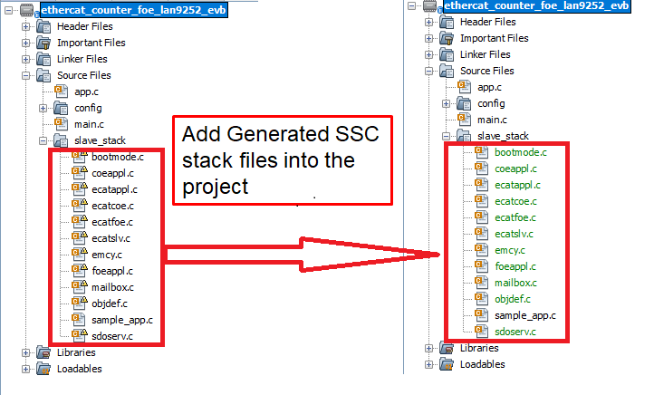
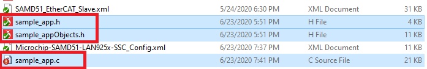
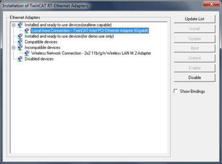

# EtherCAT Counter-Trigger and FoE Application for EVM_LAN9255_SAME53 SPI Communication

This EtherCAT example application demonstrates Counter-Trigger and Firmware Update over EtherCAT capability with SPI communication. The Counter and Trigger parameters are configured in the **< ethercat repo >/apps/ethercat_counter_foe_app/firmware/src/slave_stack/lan9255** and demonstrates the communication between the EtherCAT Manager (TwinCAT Manager) and the EtherCAT Client (EtherCAT LAN9255).The firmware update is performed by FoE (File over EtherCAT) protocol. It is triggered by the EtherCAT Manager (TwinCAT Manager) which then download the firmware onto the EtherCAT Client (EtherCAT LAN9255) communication with EVB_LAN9255_SAME53 board.

**Note :** The EtherCAT Library can also be configured to execute on other EthertCAT development boards available from Microchip. Additional instruction at available in the [Create your first EtherCAT Application](https://github.com/Microchip-MPLAB-Harmony/ethercat/wiki/create-your-first-ethercat-application) section.

This demonstration help document contains the following sections:

1. MPLAB® Harmony Software Setup
2. Hardware Setup
3. Beckhoff Slave Stack Code (SSC) Generation
4. MPLAB® Harmony Code & Project Configuration
5. Completing The EtherCAT Application
6. Running The Application
    1. TwinCAT Manager and Microchip EtherCAT Client communication
        1. EtherCAT interface detect and EEPROM Programming
        2. Trigger and Counter Demonstration
        3. File over EtherCAT communication

## 1. **MPLAB® Harmony Software Setup**
The following MPLAB® software components are a prerequisite for the rest of the steps in this demonstration. Please follow the download and installation instructions available at below links.
  * [MPLAB® X Integrated Development Environment](https://www.microchip.com/mplab/mplab-x-ide)
  * [MPLAB® XC32/32++ C Compiler](https://www.microchip.com/mplab/compilers)
  * [MPLAB® Harmony Configurator](https://github.com/Microchip-MPLAB-Harmony/)
  * On the management PC, download and Install on the TwinCAT 3 Engineering Full Setup at https://www.beckhoff.com/english.asp?download/tc3-download-xae.htm. Select the latest TwinCAT 3.1 Version and click on the link. Note the dialog box shows the TwinCAT tool that will be installed **TC31-Full-Setup.3.1.XXXX.XX** and click on "Start Download". Follow instructions to download.

## 2. **Hardware Setup**
The following tools will be used to program and debug the application on the target hardware.
 * [MPLAB® ICD4]( https://www.microchip.com/DevelopmentTools/ProductDetails/DV164045) + ICD4/PICKIT 3 Target Adapter Board using JTAG interface.

The following development board will be used for EtherCAT application development and run the application.

  * [LAN9255 - EtherCAT Client Controller evaluation kit with SAME53 Microcontroller](https://www.microchip.com/DevelopmentTools/ProductDetails/PartNO/EV44C93A#additional-summary)

    The instructions in this guide are also  applicable to other development boards with LAN9255 EtherCAT Client device. Hardware settings are board dependent and may vary between boards.

  * Connect a micro USB cable to J8 port for power source.
  * For programming, Connect a ICD4 JTAG cable to the J10 port of the EVB_LAN9255_SAME53 board.
  * Connect RJ45 connector J1 to the TwinCAT Manager.
  * Jumper setup for LAN9255 device w.r.t to different mode

    

  * Block diagram of the EVB_LAN9255_SAME53 board -

    

## 3. **Beckhoff Slave Stack Code (SSC) Generation**

Follow instruction at this link to generate Beckhoff Slave Stack Code: [Steps to generate Beckhoff Slave Stack Code  ](../../docs/readme_ssctool.md)

## 4. **MPLAB® Harmony Code & Project Configuration**
The present MPLAB Harmony v3 project is based on both **MPLAB Code Configurator (MCC)** and **MPLAB Harmony3 Project Configurator(MHC)**.

To work with MCC , user require to follow the steps that is mentioned in the below link

<https://microchipdeveloper.com/harmony3:update-and-configure-existing-mhc-proj-to-mcc-proj>

**NOTE** - To create a new MPLAB Harmony v3 project using MPLAB Code Configurator (MCC) , user require to follow these steps mentioned in this following link

<https://microchipdeveloper.com/harmony3:getting-started-training-module-using-mcc>

There are two options available for downloading/installing the MPLAB® Harmony Software Repositories from github & gitee.

The required repositories can be cloned from the github (or gitee) by using a local git client (such git bash). The MPLAB® Harmony Repositories are available at the following links:

 <https://github.com/Microchip-MPLAB-Harmony/>

 <https://gitee.com/Microchip-MPLAB-Harmony/>

The **csp, dev_packs, mcc (or mhc) and ethercat** repositories should be cloned. The required repositories can also be cloned (downloaded) or previously downloaded repositories can be updated by using the MPLAB® Harmony 3 Content Manager. The following sections provide details on using the MPLAB® Harmony 3 Content Manager to download the repositories.

1. Refer to the EtherCAT **MPLAB® Harmony Software Setup** https://github.com/Microchip-MPLAB-Harmony/ethercat/wiki/create-your-first-ethercat-application details to create a EtherCAT project.

2. The following Project Graph diagram shows the required Harmony components those are included for the present EtherCAT application for the EVB_LAN9255_SAME53 board.

    

3. Click on the EtherCAT Stack in the Project Graph window. In the Configuration window,   
    * The **Beckhoff Slave Stack source directory path** should point to the folder that contains the files generated by the SSC tool.
    * **Enable FoE** checkbox enables **File over EtherCAT** feature.

    

4. Click on **LAN9255** component from the project graph.
    * **EtherCAT Interrupt Priority Level** :- This defines a interrupt priority range. All application interrupts whose priority is more than or equal to this level will be disabled during an EtherCAT interrupt service routine execution.
    * **Ethercat EEPROM Emulation  Enabled** :- EEPROM Emulation is enabled for this device to work with TwinCAT manager.
    * Following table maps EtherCAT interrupt name with respective peripheral channel selection. **EIC interrupt handler and the SPI chip select Configuration for EVB_LAN9255_SAME53**

        | Interrupt  Name   |   EIC Channel  |    
        |-------------------|:--------------:|
        | SYNC0  Interrupt  |  EIC_EXTINT0   |
        | SYNC1  Interrupt  |  EIC_EXTINT1   |
        | IRQ    Interrupt  |  EIC_EXTINT7   |

        | Other Usage       |   Port Pin     |
        |:-----------------:|:--------------:|
        | SPI Chip Select   |  PORT RB11     |
        | Error Select Pin  |  PORT RB31     |

    **NOTE** - ,  EIC/GPIO/PIO pins for external event registration and event handler processing can be selected based on the microcontroller and LAN9255 interrupt support .

    

    |SPI Cofiguration Mode Supported     | Description  |   
    |:----------------------------------:|:------------:|
    | ETHERCAT_SPI_INDIRECT_MODE_ACCESS  | SPI Indirect Mode |
    | ETHERCAT_SPI_DIRECT_MODE_ACCESS    | SPI Direct Mode  |
    | ETHERCAT_SPI_BECKHOFF_MODE_ACCESS  | SPI Beckhoff Mode |

5. **EIC**, **QSPI** and **TC0** are configured as per the application requirement.

6. These are the below PINs configured for the application

    * **QSPI PIN Configuration for EVB_LAN9255_SAME53**

        | QSPI Custom Name  |   Function       | PORT PIN ID  |
        |:-----------------:|:----------------:|:------------:|
        | QSPI_MOSI         |  QSPI_DATA0      |    PA08      |
        | QSPI_MISO         |  QSPI_DATA1      |    PA09      |
        | QSPI_SCK          |  QSPI_SCK        |    PB10      |
        | SPI_CS            |   GPIO           |    PB11      |

    * **PIN Configuration for EtherCAT External Interrupt Pins for EVB_LAN9255_SAME53**

        | EIC Custom Name |   EIC Channel  |    Port Pin    |
        |:---------------:|:--------------:|:--------------:|
        | EIC_EXTINT0     |  EIC_EXTINT0   |   PORT  PB16   |
        | EIC_EXTINT1     |  EIC_EXTINT1   |   PORT  PB17   |
        | EIC_EXTINT7     |  EIC_EXTINT7   |   PORT  PB23   |

    

    

7. Open **NVIC configuration** window from MHC→Tools. Set the QSPI Interrupt Priority Level to 2. This interrupt priority level is selected to be less than value of the **EtherCAT Interrupt Priority Level** configuration option in the **LAN9255** component .

    

8. The application will use the default clock options. No changes are required in clock settings.

9. The FoE application uses a customized linker file. The **ROM_LENGTH** attribute in the linker file is modified to 0x80000 for **LAN9255ZMX020** (ATSAME53J20A). Bank A memory range is configured from 0x00000 to 0x7FFFF. Bank B memory range is configured from 0x80000 to 0xFFFFF.

    * The **Dual Bank** feature enables the FoE firmware to be executed from one bank while an updated version of the firmware is programmed into the other bank. The APP_BankSwitch() application function is called to swap the banks and to reset the device when the programming is complete. The APP_RunApplication() function is called to execute the new firmware.

    * EEPROM Emulation starts from 0x3E000 (EEPROM_ORIGIN) and total length is 2000.

    * To add a customized linker file to the project, uncheck the **Add linker file to project** option. Navigate to **System>Project Configuration>Tool Chain Selections>Add linker file** in the MHC Project graph to add the customized linked script file.

    See the below screen shots:    
    

10. Generate the code by clicking the **Generate Code** button (marked in red).

    

11. The following diagram shows the generated EtherCAT project. This contains the **sample_app.c** file. It does not contain Beckhoff Slave stack code. The Beckhoff Slave Stack Code should be generated using the SSC tool with the required configuration and the Microchip-SAME53-EtherCAT-Slave_SSC_Config_SPI_< direct/indirect/beckhoff >_mode.xml file. The folder view on the right side in the below figure shows the EtherCAT project with SSC stack files added to the folder.

    

## 5. **Completing The EtherCAT Application**

This section demonstrates the MPLAB® X IDE projects for the **ethercat_counter_foe_app** application. The following table list the MPLAB® X projects available for the demonstration. These projects are available inside **< install-dir >/ethercat/apps/ethercat_counter_foe_app/firmware** .

1. MPLAB® X project table

    | Project Name  |  Target Device | Target Development board  | Description |
    |:-------------:|:--------------:|:------------------------:|:-----------:|
    |SAME53_lan9255_evb.X|LAN9255ZMX020|EVB-LAN9255_SAME53|ETherCAT evaluation board with LAN9255 with SPI Communication|

2. The project contains the MPLAB® Harmony components that are required for an EtherCAT application. The application files need to be added to the project.

    The application source files for the **ethercat_counter_foe_app** which are available in **Harmony_Repo_Path/h3/ethercat/apps/ethercat_counter_foe_app/firmware/src**.

3. The **app_lan9255.c**, **app_lan9255.h**, **main.c** files are updated to demonstrate the application.

4. The **apps/ethercat_counter_foe_app/firmware/src/config/SAME53_lan9255_evb/ethercat_foe.ld** linker file is a modified linker file which is used for FOE application.

5. The sample application files **eeprom.h**, **sample_app.c**, **sample_app.h** and **sample_appObjects.h**, generated by SSC tool, are updated for the application requirement.

    

    The SSC tool generated sample application files, highlighted in the above screen capture above, are updated for Counter, Trigger peripheral interface and for the FoE read/write operations. These are available in the **apps/ethercat_counter_foe_app/firmware/src/slave_stack** folder.

6. Verify the **XC32** Compiler Toolchain version and set the **Connected Hardware Tool** to **ICD4** or **PICkit 3**. Press **Apply** button and then press **OK** button.

7. Build the application by clicking on the **Build Main Project**.

## 6. **Running The Application**

### 1. **TwinCAT Manager and Microchip EtherCAT Client communication**

#### 1. EtherCAT interface detect and EEPROM Programming

1. Upon successful installation of the TwinCAT Manager, the network adapter will be moved to Installed and ready to use devices section as shown in the following figure.

    

    Please find the below table for the available Client configuration files which are generated by SSC tool.

    | Client Configuration File      |       Mode          |
    |-------------------------------|:-------------------:|
    | SAME53_SPI_Indirect_Mode.xml  |   SPI Indirect mode |   
    | SAME53_SPI_Direct_mode.xml    |   SPI Direct mode   |
    | MSAME53_SPI_Beckhoff_mode.xml |   SPI Beckhoff mode |

2. Default EEPROM Emulation is enabled for the EVB-LAN9255_SAME53 evaluation board. The strap along with EE_EMULI1 and EE_EMUL2 configures the default PDI selection during EEPROM Emulation mode.
    * Jumper Settings as per the different modes -
        * **Indirect mode** -

            | Jumper (J17) |  Description   | Configuration  |
            |:------------:|:--------------:|:--------------:|
            | JP3     |  EE_MUL0   |  0 and 1 connected    |
            | JP4     |  EE_MUL0   |  0 and 1 connected    |
            | JP5     |  EE_MUL1   |  0 and 1 connected    |
            | JP5     |  EE_MUL2   |  0 and 1 connected    |

        * **Direct mode** -

            | Jumper (J17) |  Description   | Configuration  |
            |:------------:|:--------------:|:--------------:|
            | JP3     |  EE_MUL0   |  0 and 1 connected    |
            | JP4     |  EE_MUL0   |  0 and 1 connected    |
            | JP5     |  EE_MUL1   |  0 and 1 connected    |
            | JP5     |  EE_MUL2   |  1 and 2 connected    |

3. In TwinCAT XAE, create a New Project **(File=>New=>Project)**. In the New Project Window, select the TwinCAT Projects option and then click OK

    

4. Connect port zero (J1 connector) of the EVB_LAN9255_SAME53 board to the TwinCAT Manager using a RJ45 Ethernet cable, and then power up the board. The Link/Act LED should be ON at Port zero when the cable is connected. If the Link/Act LED is not ON, then this indicates that there is an issue with the connection or the cable.

5. Expand the IO option in the TwinCAT XAE project window and right click on Devices. Select Scan.

   

6. Click OK  if the TwinCAT network interface is selected  and continue scanning as shown in the below image.

    

7. Click OK to continue scanning  and Click Yes in the Scan for boxes prompt.

    

8. **EEPROM Programming** After a successful scan, click on Device 2 (EtherCAT) in the solution explorer window of the TwinCAT tool  and Click Online in the TwinCAT project window. Once this is done, highlight the Device. This should read OP.

    

#### 2. Trigger and Counter Demonstration

  This section describes the Tigger ( Output value for the TwinCAT manager and Input value to the LAN9255 EtherCAT device ) parameter and the Counter (Input value to the TwinCAT manager and Output value for the LAn9255 EtherCAT device ) parameter configuration. Counter parameter value is determined based on Trigger parameter value. If Trigger parameter value is 0, then Counter parameter is cleared. Trigger parameter value is used to determine value of Counter parameter.

1. **Input Trigger configuration** -  From I/O level on the Solution Explorer (left window), go to **Devices=>Device # (EtherCAT)=>Box 1 (SAME53 EtherCAT Slave)=>Outputs process data mapping=>Trigger**.

2. To change the Trigger parameter value, click on the Trigger which is available under **Output process data mapping** in the Search Solution Explorer window. In the top center window, select Online tab. Click Write and then enter **1** in Decimal: field and click OK.( Trigger parameter value can be anything. The default Trigger parameter value is used here .)

    

3. **Output Counter Observation** - From I/O level on the Solution Explorer (left window), go to **Devices=>Device # (EtherCAT)=>Box 1 (SAME53 EtherCAT Slave)=>Inputs process data mapping=>Counter**.

4.	The Counter parameter value will be incremented based on the Trigger value. ( The Counter value will not be a stable value and will keep incrementing based on the Trigger value. ) In the top center window, select Online tab.

    

#### 3. File over EtherCAT communication

1. **FoE (File over EtherCAT) Test Update** - Click on Box1, Select "Online" tab.
    Before FoE test **Curent state** and **Requested state** should be in **OP** mode.

    

2. For file download, change the mode from INIT to BOOT mode.

    

3. After clicking **Download** button , select **BIN** file that need to be downloaded and configure the **Password** as per the **EtherCAT component password** configuration.

    

    The sample **BIN** files are present in **< harmony-repo >/ethercat/apps/ethercat_counter_foe_app/firmware/src/FoE_Bin_imagefiles/lan9252_foe_binfiles** folder can be used to verify the operation of the FoE application.

     **NOTE** - A **BIN** file can be generated from the generated  EtheCAT **HEX** image after configuring the **Project Properties->Conf:->Building->Execute This Line After Build** ${MP_CC_DIR}/xc32-objcopy" -I ihex -O binary "${DISTDIR}/${PROJECTNAME}.${IMAGE_TYPE}.hex" "${DISTDIR}/${PROJECTNAME}.${IMAGE_TYPE}.bin

    

    **NOTE** - The  **Execute This Line After Build** option should be unchecked in debug mode.

4. The download process can be tracked as shown in the figure below-

    

5. After successful download, change the state from BOOT to INIT mode. This helps the application switch the bank from BANK B to BANK A and the newly downloaded firmware  will be executed from BANK A. The new application starts running from flash location 0x0.

    
