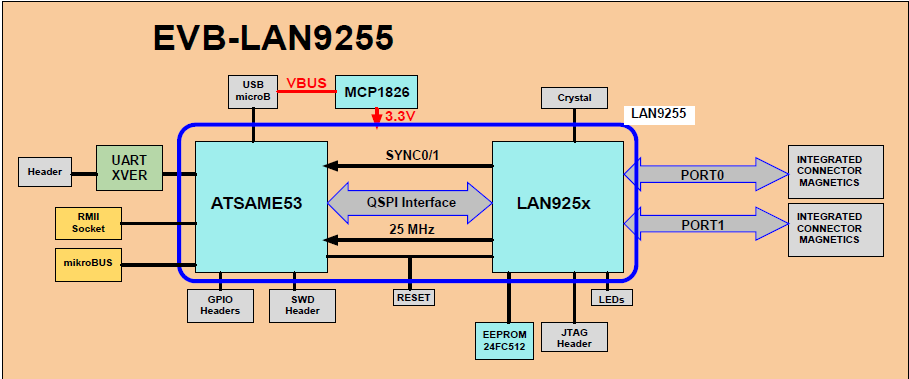
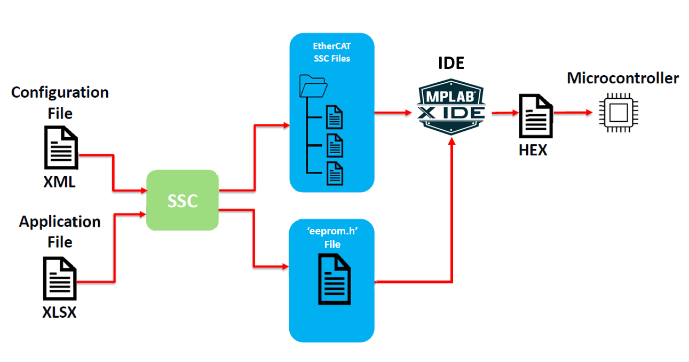
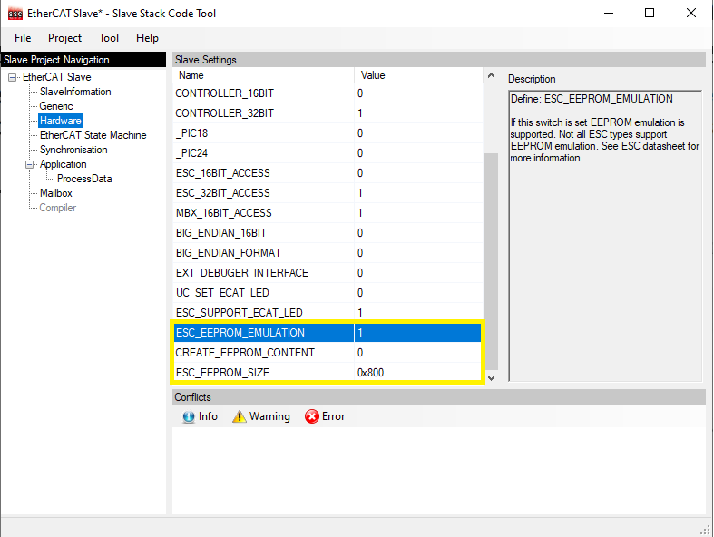

# EtherCAT LAN9255 Library

Ethernet for Control Automation Technology (EtherCAT) was developed by Beckhoff. EtherCAT is a fast and deterministic network, It processes data using dedicated hardware and software. It is based on a full duplex, manager(TwinCAT Manager)-client(LAN9255 Client) configuration.

The LAN9255 is a 2/3-port EtherCAT Client controller with dual integrated Ethernet PHYs which each contain a fullduplex 100BASE-TX transceiver and support 100Mbps (100BASE-TX) operation.

The EtherCAT LAN9255 Library contains a EtherCAT Client Controller Interface layer that enables Microchip MCUs to communicate with the LAN9255 EtherCAT Client controller. This interface layer supports different communication interfaces (QSPI (SPI/SQI mode), GPIO). The interface layer also serves as a Host peripheral bridge between the EtherCAT Beckhoff Slave Stack Code (SSC) and the LAN9255. The SSC Stack (generated from standard SSC tool) contains features such as File over EtherCAT (FoE) and EEPROM Emulation for MCU firmware upgrade from TwinCAT tool.

## EEPROM Emulation

In some system configurations the PDI (Processor Data Interface) is disabled, since much of the device is configured by the EEPROM contents. When EEPROM Emulation mode is used, the PDI configuration must be selected, as the EEPROM configuration data will be stored on the microcontroller’s internal memory. The microcontroller will configure the LAN9255 over the PDI interface and no external EEPROM device will be required to be connected to the LAN9255.

*   **Hardware Configuration**:-

    | EE_EMUL[2:0] |                               PDI_SELECT |
    |:---------------------------:|:-------------------------:|
    |000 | 0x80 (SPI) |
    |001 | 0x95 (HBI Indexed 16bit EtherCAT Direct Mapped) |
    |010 | 0x91 (HBI Multiplexed 1 Phase 16-bit EtherCAT Direct Mapped) |
    |011 | 0x93 (HBI Multiplexed 2 Phase 16-bit EtherCAT Direct Mapped) |
    |100 | 0x82 (SPI EtherCAT Direct Mode) |
    |101 | 0x05 (Beckhoff SPI Mode) |
    |110 | Unused |
    |111 | EEPROM is enabled |

* **Software Configuration**:-

    Microchip provides ESF Demo code, which includes application files that support EEPROM Emulation, Configuration file (.xml) and Application file (.xlsx) are also provided.

    From the EtherCAT master’s point of view, there is no difference between EEPROM Emulation mode and I2C EEPROM, the master just issues EEPROM commands and wait until the EEPROM interface is no longer busy.

    Normally the ESI file that is loaded on the EEPROM, is generated using the SSC tool from Beckhoff. The EEPROM Emulation mode of the SSC tool must be configured for ESC EEPROM Emulation mode.

    

    |EEPROM Emulation configurations parameter| Description |
    |:----------------------------------------:|:-----------:|
    |ESC_EEPROM_EMULATION| If set to 1, the EEPROM emulation is enabled and EEPROM commands are handled by the SSC.|
    |CREATE_EEPROM_CONTENT | If set to 1, then a header file including the EEPROM data according to the slave configuration will be created during the slave file generation process.|
    |ESC_EEPROM_SIZE | Available EEPROM buffer size in Bytes.|
    |EEPROM_READ_SIZE| Number of Bytes the ESC can handle on a single read access. For LAN9255, this value is 0x08 |
    |EEPROM_WRITE_SIZE| Number of Bytes the ESC can handle on a single write access. This value is always 2.|

    For SSC tool EEPROM emulation ,select Hardware in Slave Project Navigation Window and make sure ESC_EEPROM_SIZE is 0x800, ESC_EEPROM_EMULATION is 1 & CREATE_EEPROM_CONTENT is 0.

    SSC tool EEPROM Configuration -

    

    |EtherCAT EEPROM Register Address| Register Name |
    |:------------------------------:|:--------------:|
    |0x140 | PDI Control Register |
    |0x141 | ESC Configuration Register |
    |0x150 | PDI Configuration Register |
    |0x151 | Sync/Latch PDI Configuration Register |
    |0x982:0x983 | Pulse Length of SyncSignals Register |
    |0x152:0x153 | PDI Extended Configuration Register |
    |0x0012:0x0013 | Configured Station Alias |
    |0x0510:0x0511 | MII Management Control/Status Register |
    |0x0142:0x0143 | ASIC Configuration |
    |Reserved 0x144:0x145 | Reserved |

## Fatures Supported

* Supports the app_lan9255 EtherCAT Client Controller device
* Supports EEPROM Emulation
* Enables interfacing with different 32-bit microcontroller devices
* Contains File over EtherCAT and Trigger & Counter demonstration applications.
* Demonstration applications are targeted for EVB-LAN9255-SAME53 Evaluation Board.
* Demonstration applications are configured to use the SSC Error LED feature. This feature is implemented through the ERROR LED indicator on the board. When the ERRRO LED is ON, this indicates either of the following conditions:
    * EEPROM loading error
    * EtherCAT client connectivity link failure
    * Application Layer Event (AL Event) error indication
    * EtherCAT State mode transition error indication
* The demonstration applications do not use the SSC Run LED feature.
* Driver supports SPI Indirect, SPI Direct and Beckhoff SPI mode of Process Data Interface(PDI) selection.

    | Process Data Interface Mode | EEPROM Source Data Config |
    |:---------------------------:|:-------------------------:|
    | SPI/SQI Indirect Mode           |     0x80    |
    | SPI/SQI Direct Mode             |     0x82    |

    The **EEPROM Source Data config** data in the above table should be specified in the **ESC CONFIG DATA** attribute in the     
    **Microchip-SAME53-LAN9255-EtherCAT-Slave_SSC_Config_SPI_SQI_XXX_mode.xml** file.

* **FoE (File Over EtherCAT)** can be used to download and upload a file to an EtherCAT device. Bank Switch algorithm is used to switch the new firmware downloaded.

*  The LAN9255 SPI or SQI Client module provides a low pin count synchronous client interface that facilitates communication between the LAN9255 and the microcontroller. The SPI client provides the microcontroller access to the LAN9255 System Control and Status Registers, internal FIFOs and memories.

    The following is an overview of the functions provided by the LAN9255 SPI/SQI Client:
    * Serial Read: 4-wire (clock, select, data in and data out) reads at up to 30 MHz Serial command, address and data. Single and multiple register reads with incrementing, decrementing or static addressing.

    * Fast Read: 4-wire (clock, select, data in and data out) reads at up to 50 MHz Serial command, address and data. Dummy Byte(s) for first access. Single and multiple register reads with incrementing, decrementing or static addressing.

* The Beckhoff Slave Stack Code supports different modes of synchronization which are based on three physical signals: (PDI_)IRQ, Sync0 and Sync1.Both SM-Synchron and Distributed Clocks (DC) synchronization are supported.

## LAN 9255 Firmware Overview

* drv_lan9255_ecat_util.c and drv_lan9255_ecat_util.h files are interfaced to Lan 9255 driver.

|Name	|SPI Different Mode API Description|
|:------:|:----------:|
|ECAT_Initialization|	Initialize the hardware interface (SPI) used to communicate with Client Controller|
|ECAT_Lan9255_IsPDIFunctional	|Verifies the hardware interface (SPI) is functional or not |
|ECAT_Lan925x_SPIWrite |	Initiates an *Indirect mode* write transfer to Client Controller via selected PDI|
|ECAT_Lan925x_SPIRead |	Initiates an *Indirect mode* read transfer to Client Controller via selected PDI |
|ECAT_Lan925x_SPIFastRead |	Initiates an *Indirect mode* fast-read transfer to Client Controller via selected PDI |
|ECAT_Lan925x_SPIReadPDRAM |	Initiates an *Indirect mode* read process data RAM transfer to Client Controller via selected PDI |
|ECAT_Lan925x_SPIFastReadPDRAM |	Initiates an *Indirect mode* fast-read process data RAM transfer to Client Controller via selected PDI |
|ECAT_Lan925x_SPIWritePDRAM |	Initiates an *Indirect mode* write process data RAM transfer to Client Controller via selected PDI |
|ECAT_Lan9255_SPIWrite |	Initiates a *direct mode* write transfer to client Controller via selected PDI|
|ECAT_Lan9255_SPIRead |	Initiates a *direct mode* read transfer to Client Controller via selected PDI |
|ECAT_Lan9255_SPIFastRead |	Initiates a *direct mode* fast-read transfer to Client Controller via selected PDI |
|ECAT_Lan9255_Beckhoff_SPIWrite |	Initiates a *Beckhoff mode* write transfer to Client Controller via selected PDI|
|ECAT_Lan9255_Beckhoff_SPIRead |	Initiates a *Beckhoff mode* read transfer to Client Controller via selected PDI |
|ECAT_ESCIRQInitialization| Interrupt service routine initialization for the interrupt from EtherCAT Client Controller|
|ECAT_SyncInterruptsInitialization| Sync0 and Sync1 Interrupt service routine Initialization|

|Name	|SQI Different Mode API Description|
|:------:|:----------:|
|ECAT_Lan925x_SQIWrite |	Initiates an *Indirect mode* or *Direct Mode* SQI write transfer to Client Controller via selected PDI|
|ECAT_Lan925x_SQIRead |	Initiates an *Indirect mode*  or *Direct Mode* SQI  read transfer to Client Controller via selected PDI |
|ECAT_LAN925x_SQIWritePDRAM |	Initiates an *Indirect mode* SQI write process to Client Controller via selected PDI |
|ECAT_Lan925x_SQIReadPDRAM |	Initiates an *Indirect mode* SQI read process data RAM transfer to Client Controller via selected PDI |
