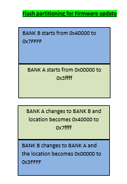
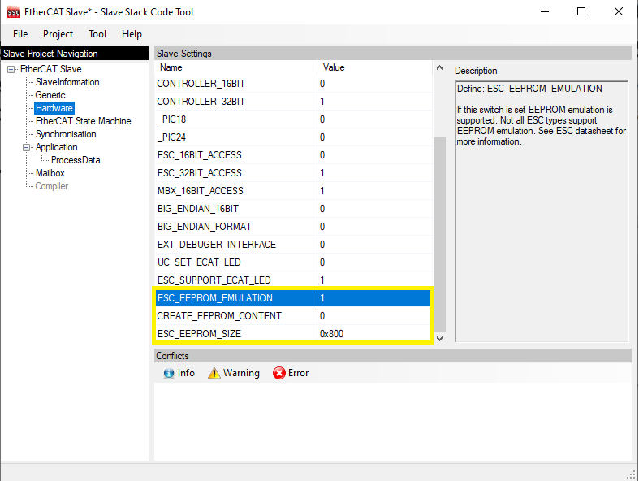

# EtherCAT LAN925x Library

EtherCAT LAN925x Client device software utility framework is a layered software framework designed to operate with different PIC and Cortex Microcontroller peripherals.

* **LAN925x EtherCAT Framework**

    | EtherCAT Client Framework    |Description                |
    |:---------------------------:|:-------------------------:|
    | [LAN9252 EtherCAT Framework](docs/readme_drvlan9252.md)   |    This Framework implements a EtherCAT Client Controller Interface layer for the LAN9252 device    |
    | [LAN9253 EtherCAT Framework](docs/readme_drvlan9253.md)   |     This Framework implements a EtherCAT Client Controller Interface layer for the LAN9253 device     |
    | [LAN9255 EtherCAT Framework](docs/readme_drvlan9255.md)   |     This Framework implements a EtherCAT Client Controller Interface layer for the LAN9255 device     |

Ethernet for Control Automation Technology (EtherCAT) was developed by Beckhoff. EtherCAT is a fast and deterministic network. It processes data using dedicated hardware and software. It is based on a full duplex, manager(TwinCAT Manager)-client(LAN925x Client) configuration.

The LAN925x is a 2/3-port EtherCAT client controller with dual integrated Ethernet PHYs which each contain a fullduplex 100BASE-TX transceiver and support 100Mbps (100BASE-TX) operation.

Use of the Microchip EVB-LAN925x (and similar EtherCAT interface devices) requires use of the Beckhoff EtherCAT Slave Stack Code (SSC) and its associated configuration and code generation tool.

* The **interrupts** have to be configured during hardware initialization.
    *   **PDI ( Process Data Interface ) Interrupt** -
    This is a programmable interrupt. It is triggered via the TwinCAT manager by enabling the **Synchron Synchronization** mode. There are various operational modes in the LAN925x device that can cause this interrupt.

    * **DC - SYNC0 AND SYNC1** -
    If the application running on the micrcontroller requires Distributed Clock, then LAN925x SYNC0 and SYNC1 pins should be connected to the microcontroller’s external interrupt lines. Refer to LAN9252 datasheet for configuration of SYNC0 and SYNC1.

    * **TIMER Interupt** -
    The SSC employs a variable that counts up every one millisecond by default. This variable can be accessed via an interrupt or a polling method. If accessed via an interrupt, the interrupt occurs every one millisecond.  The interrupt/polling mode can be selected in the SSC Tool before generating the Beckhoff slave stack code.
    It should be noted that the SSC will access EtherCAT ECAT_CSR_CMD and ECAT_CSR_DATA core registers from both interrupt context and polling mode. This can corrupt the SSC state machine. These registers should therefore be protected against simultaneous access.

* **SSC Library Configuration**

    The SSC provides a set of EtherCAT Client Device Indicators. These indicators are composed of an Ethercat Trigger and counter variable. These indicators support visual inspection and troubleshooting of the driver and the Ethercat Network. This section contains additional details about these indicators.

    1. **PDO ( Process Data Object Trigger and Counter )** -
    The PDO protocol is used for communication with External interrupt IRQ.

        | Index  |  Object | Type           | Direction |
        |:------:|:-------:|:--------------:|:---------:|
        |1       |0x6000   |32bit Counter   |TX         |

    2. **Receive PDO Mapping ( Outputs )** -
    The PDO protocol is used for communication with External interrupt IRQ.

        | Index  |  Object | Type           | Direction |
        |:------:|:-------:|:--------------:|:---------:|
        |1       |0x7010   |32bit Counter   |RX         |

* **Using the Library**

    This section provides details about the File Over EtherCAT (FoE) protocol and EEPROM Emulation Configuration in this library.

    The below flowchart depicts the Host/Client interaction during a Firmware Update operation. The microcontroller Flash Dual Bank feature enables a firmware to execute from one bank while the other Flash bank is programmed with a Firmware Update. The APP_BankSwitch() application function is called to swap the banks and to reset the device when the programming is complete.

    

    The below figure shows the Dual Bank organization used by FOE demonstration on a ATSAMD51J19A device.

    

    The firmware upgrade is performed as follows:

    * Selecting the Bootstrap option in the TwinCAT manager changes the state machine state from INIT to BOOT and initiates a file download.  The SSC code receives intimation to change mode from INIT to BOOT and gets ready to write the new firmware to Bank B location (0x40000 on the ATSAMD51j19A device ). The gFirmwareDownload_Started flag set to 1.

    * The TwinCAT manager downloads the password (default value as **0x11223344**) and the firrmware binary file. This file is generated from the existing ATSAMD51J19A FoE ATMEL Studio IDE project. In the SSC stack, the FOE_FILEDOWNLOAD_PASSWORD configuration constant is set to 0x11223344. This constant can be modified through the EtherCAT component in MPLAB Harmony Configurator (MHC). The FoE_Write() function checks the file name size (this is limited to 16 characters), verifies the password and then proceeds to call the FoE_WriteData() function.

    * After completing the file transfer, the TwinCAT manager state is changed from BOOT to INIT. This triggers the APP_FW_GetDownloadStateFinished() function in the client firmware changes. The gFirmwareDownload_Started flag is cleared and the APP_FW_StateBOOTtoINIT() function sets the gFirmwareDownload_Finished flag to 1.

    * After the state change from BOOT to INIT is complete, the Client application initiates a bank switch ( by calling the APP_BankSwitch() function) and then performs a software reset(by calling the run_application() function). This causes the execution of the application stored in BANK B location. The Bank B location is now treated as Bank A and the start location of Bank B is treated as location 0x0 of Bank A. The execution of the downloaded updated application will start.

    SSC tool FoE configuration -

    

    * For SSC tool EEPROM emulation ,select Hardware in Slave Project Navigation Window and make sure ESC_EEPROM_SIZE is 0x800, ESC_EEPROM_EMULATION is 1 & CREATE_EEPROM_CONTENT is 0.

    SSC tool EEPROM Configuration -

    
